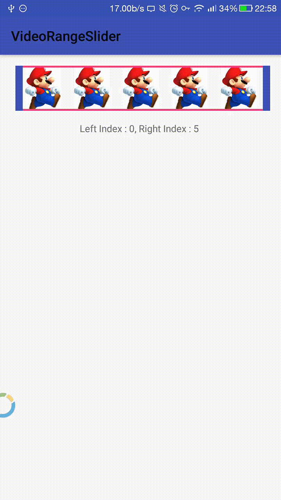

# VideoRangeSlider
The VideoRangeSlider is similar to [RangeBar](https://github.com/edmodo/range-bar) for selection a range,  but specific design for trim a video

**Note: The library do not implement the function of trim video or fetch video thumbnails**



## Installation
```
repositories {
    maven { url "https://jitpack.io" }
}

dependencies {
  compile 'com.github.waynell:VideoRangeSlider:1.0.0'
}
```

## Usage
1. Add VideoRangeSlider into your layout
```xml
<com.waynell.videorangeslider.RangeSlider
            app:lineSize="3dp"
            app:lineColor="@color/colorAccent"
            app:thumbWidth="@dimen/range_thumb_width"
            app:leftThumbDrawable="@drawable/thumb_drawable"
            app:rightThumbDrawable="@drawable/thumb_drawable"
            android:id="@+id/range_slider"
            android:layout_width="match_parent"
            android:layout_height="66dp"/>
```

2. Set a listener to observe range change event
```java
slider.setRangeChangeListener(new RangeSlider.OnRangeChangeListener() {
	@Override
	public void onRangeChange(RangeSlider view, int leftPinIndex, int rightPinIndex) {
		textView.setText(String.format("Left Index : %s, Right Index : %s ", leftPinIndex, rightPinIndex));
	}
});
```

## Customization

Developers can customize the following attributes (both via XML and programmatically):
- line color
- line size
- thumb size
- left and right thumb drawable
- mask color


## License
MIT License

Copyright (c) 2016 Wayne Yang

Permission is hereby granted, free of charge, to any person obtaining a copy
of this software and associated documentation files (the "Software"), to deal
in the Software without restriction, including without limitation the rights
to use, copy, modify, merge, publish, distribute, sublicense, and/or sell
copies of the Software, and to permit persons to whom the Software is
furnished to do so, subject to the following conditions:

The above copyright notice and this permission notice shall be included in all
copies or substantial portions of the Software.

THE SOFTWARE IS PROVIDED "AS IS", WITHOUT WARRANTY OF ANY KIND, EXPRESS OR
IMPLIED, INCLUDING BUT NOT LIMITED TO THE WARRANTIES OF MERCHANTABILITY,
FITNESS FOR A PARTICULAR PURPOSE AND NONINFRINGEMENT. IN NO EVENT SHALL THE
AUTHORS OR COPYRIGHT HOLDERS BE LIABLE FOR ANY CLAIM, DAMAGES OR OTHER
LIABILITY, WHETHER IN AN ACTION OF CONTRACT, TORT OR OTHERWISE, ARISING FROM,
OUT OF OR IN CONNECTION WITH THE SOFTWARE OR THE USE OR OTHER DEALINGS IN THE
SOFTWARE.